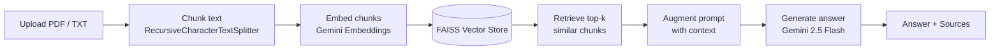

# 🧭 HR Compass — HR Policy RAG Assistant


**HR Compass** is a Retrieval-Augmented Generation (RAG) chatbot that lets
employees ask natural-language questions about company HR policies and get
accurate, grounded answers — instantly. Upload your HR policy documents
(PDF/TXT), and HR Compass answers questions **strictly from that content**,
citing the source document and page for every response.

---

## ✨ Features

- 📄 **Document ingestion** — upload one or more PDF or TXT HR policy files
- ✂️ **Smart chunking** — overlapping chunks preserve context across policy sections
- 🔎 **Semantic search** — FAISS-powered similarity retrieval finds the most relevant policy excerpts
- 🤖 **Grounded answers** — responses are generated only from retrieved context, with "I don't know" fallback to prevent hallucination
- 📚 **Source transparency** — every answer includes an expandable "Sources" panel showing the exact document/page used
- 💬 **Chat interface** — persistent conversation history within a session
- 🔒 **Secure by design** — API keys are never entered, displayed, or stored client-side

---

## 🏗️ How It Works



| Step | Component | Configuration |
|---|---|---|
| 1. Chunking | `RecursiveCharacterTextSplitter` | `chunk_size=2000`, `chunk_overlap=700` |
| 2. Embedding | `GoogleGenerativeAIEmbeddings` | `models/gemini-embedding-001` |
| 3. Vector store | `FAISS` | built from document chunks |
| 4. Retrieval | similarity search | `k=2` |
| 5. Generation | `ChatGoogleGenerativeAI` | `gemini-2.5-flash`, `temperature=0.2` |
| 6. Chain | LangChain LCEL | `RunnableParallel` + `RunnablePassthrough` + prompt + `StrOutputParser` |

---

## 🛠️ Tech Stack

- **Frontend / App framework:** Streamlit
- **Orchestration:** LangChain (LCEL)
- **LLM & Embeddings:** Google Gemini (`gemini-2.5-flash`, `gemini-embedding-001`)
- **Vector store:** FAISS
- **Document parsing:** PyPDF

---

## 📁 Project Structure

```
.
├── app.py                          # Streamlit application
├── requirements.txt                # Python dependencies
└── .streamlit/
    └── secrets.toml.example        # Template for API key configuration
```

---

## 🚀 Getting Started

### 1. Clone & install dependencies

```bash
pip install -r requirements.txt
```

### 2. Configure your Google API key

The API key is **never entered or shown in the app's UI**. Configure it
once via a secrets file or environment variable.

**Option A — secrets file (recommended for local dev):**
```bash
mkdir .streamlit
cp .streamlit/secrets.toml.example .streamlit/secrets.toml
```
Then edit `.streamlit/secrets.toml`:
```toml
GOOGLE_API_KEY = "your-google-api-key-here"
```
> ⚠️ Add `.streamlit/secrets.toml` to `.gitignore` — never commit real keys.

**Option B — environment variable:**
```bash
# Windows (PowerShell)
$env:GOOGLE_API_KEY = "your-api-key-here"

# macOS / Linux
export GOOGLE_API_KEY="your-api-key-here"
```

Get a key from [Google AI Studio](https://aistudio.google.com/app/apikey).

### 3. Run the app

```bash
streamlit run app.py
```

Open the local URL Streamlit prints (usually `http://localhost:8501`).

### 4. Use it

1. Confirm the sidebar shows **"API key configured"**.
2. Upload your HR policy PDF/TXT files.
3. Click **Build Knowledge Base**.
4. Ask questions in the chat — e.g. *"How many casual leaves am I entitled to?"*
5. Expand **📚 Sources** under any answer to see exactly where it came from.

---

## ☁️ Deploy on Streamlit Community Cloud

1. Push `app.py`, `requirements.txt`, and `.streamlit/secrets.toml.example`
   (but **not** your real `secrets.toml`) to a GitHub repo.
2. Go to [share.streamlit.io](https://share.streamlit.io) and create a new
   app pointing at `app.py`.
3. In **Settings → Secrets**, add:
   ```toml
   GOOGLE_API_KEY = "your-api-key-here"
   ```
4. Deploy. Upload HR policy documents in the running app and click
   **Build Knowledge Base**.

---

## 📝 Notes & Limitations

- The knowledge base is built **in-memory per session** — it is not
  persisted to disk and must be rebuilt after the app restarts or a new
  session starts.
- Answers are intentionally restricted to the uploaded documents; if the
  context doesn't contain the answer, the assistant responds that it
  doesn't know rather than guessing.
- Designed for internal/trusted use — uploaded documents are processed
  in-memory and sent to the Gemini API for embedding and generation.

---

## 🔮 Possible Enhancements

- Persistent vector store (save/load FAISS index to disk or cloud storage)
- Multi-user authentication and per-department policy collections
- Conversation memory for multi-turn follow-up questions
- Admin dashboard for managing uploaded policy documents
