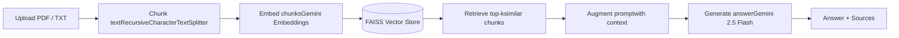

# 🧭 HR Compass — HR Policy RAG Assistant


[](https://hr-compass.streamlit.app/)


**HR Compass** is a Retrieval-Augmented Generation (RAG) chatbot that lets
employees ask natural-language questions about company HR policies and get
accurate, grounded answers — instantly. Upload your HR policy documents
(PDF/TXT), and HR Compass answers questions **strictly from that content**,
citing the source document and page for every response.

---

🔗 **Live App:** [hr-compass.streamlit.app](https://hr-compass.streamlit.app/)

---

## ✨ Features

- 📄 **Document ingestion** — upload one or more PDF or TXT HR policy files
- ✂️ **Smart chunking** — overlapping chunks preserve context across policy sections
- 🔎 **Semantic search** — FAISS-powered similarity retrieval finds the most relevant policy excerpts
- 🤖 **Grounded answers** — responses are generated only from retrieved context, with "I don't know" fallback to prevent hallucination
- 📚 **Source transparency** — every answer includes an expandable "Sources" panel showing the exact document/page used
- 💬 **Chat interface** — persistent conversation history within a session
- 🔒 **Secure by design** — API keys are never entered, displayed, or stored client-side

---

## 🏗️ How It Works



| Step | Component | Configuration |
| --- | --- | --- |
| 1. Chunking | `RecursiveCharacterTextSplitter` | `chunk_size=2000`, `chunk_overlap=700` |
| 2. Embedding | `GoogleGenerativeAIEmbeddings` | `models/gemini-embedding-001` |
| 3. Vector store | `FAISS` | built from document chunks |
| 4. Retrieval | similarity search | `k=2` |
| 5. Generation | `ChatGoogleGenerativeAI` | `gemini-2.5-flash`, `temperature=0.2` |
| 6. Chain | LangChain LCEL | `RunnableParallel` + `RunnablePassthrough` + prompt + `StrOutputParser` |

---

## 🛠️ Tech Stack

- **Frontend / App framework:** Streamlit
- **Orchestration:** LangChain (LCEL)
- **LLM & Embeddings:** Google Gemini (`gemini-2.5-flash`, `gemini-embedding-001`)
- **Vector store:** FAISS
- **Document parsing:** PyPDF

---

## 📁 Project Structure

```
.
├── app.py                          # Streamlit application
├── requirements.txt                # Python dependencies
└── .streamlit/
    └── secrets.toml.example        # Template for API key configuration
```

---

## 🔮 Possible Enhancements

- Persistent vector store (save/load FAISS index to disk or cloud storage)
- Multi-user authentication and per-department policy collections
- Conversation memory for multi-turn follow-up questions
- Admin dashboard for managing uploaded policy documents
